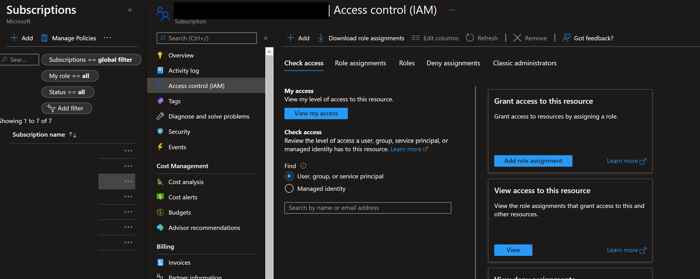
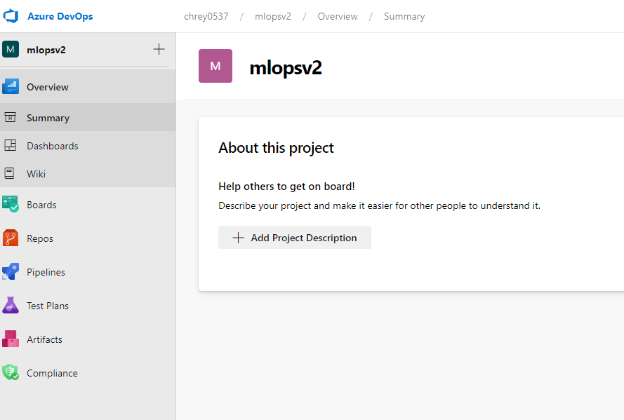
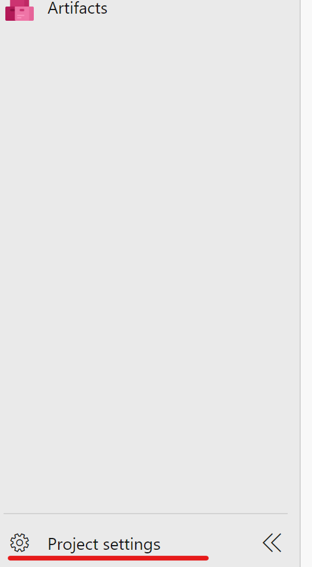
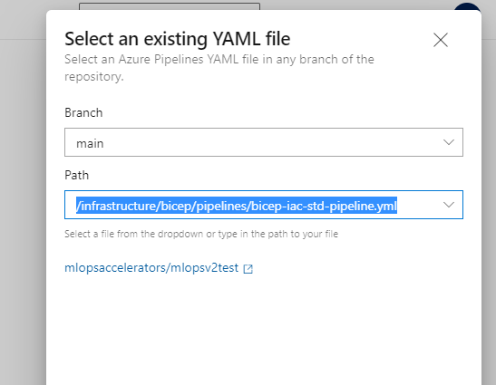
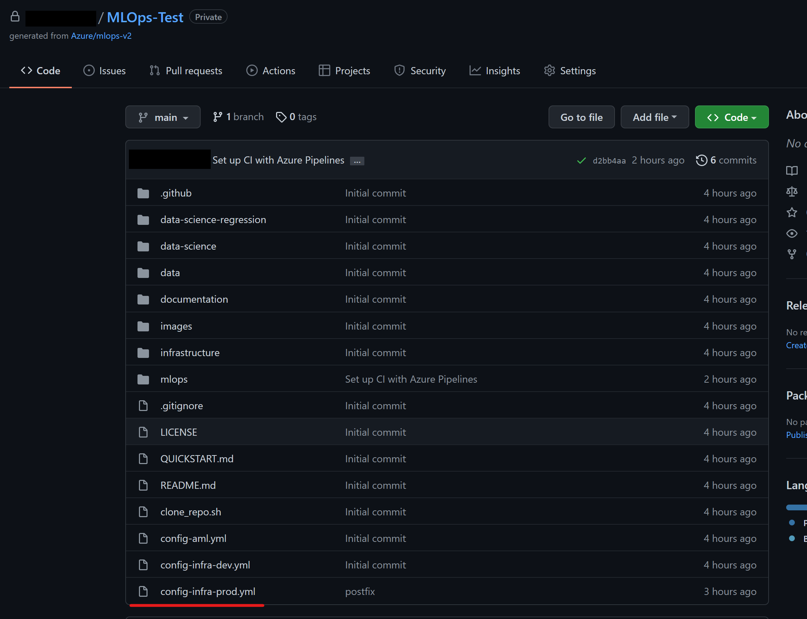
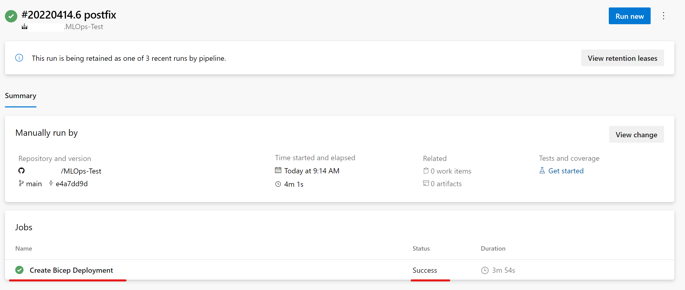
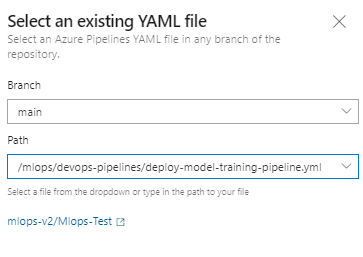
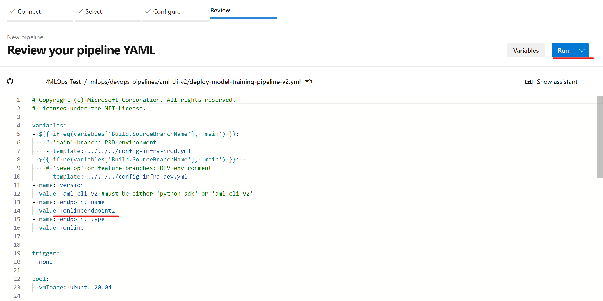
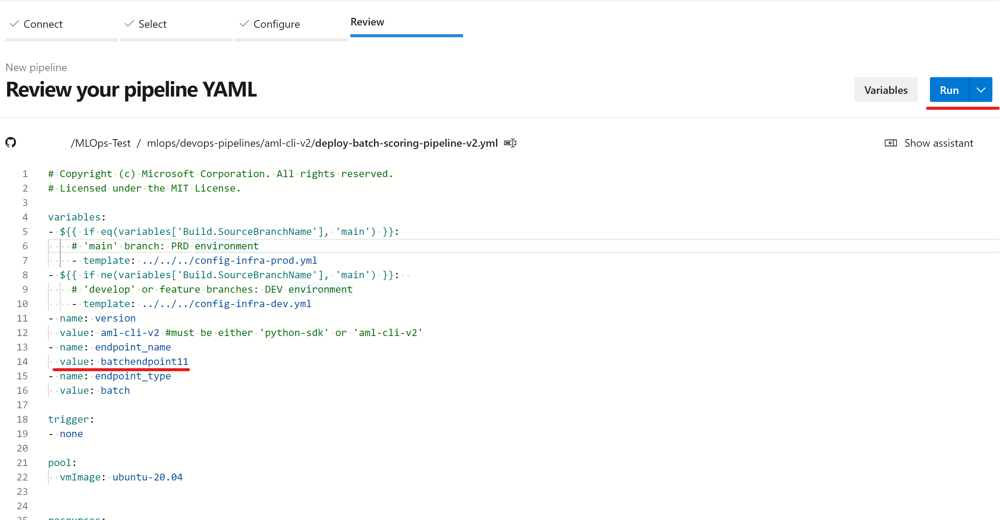
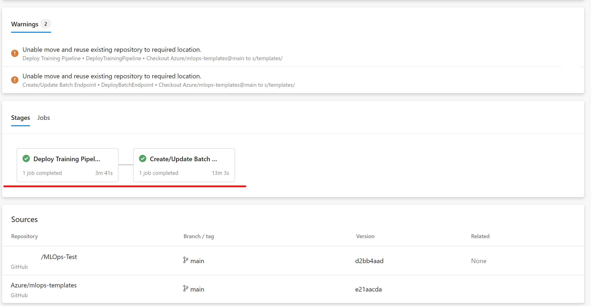

# Quickstart

## Prerequisites
---

**Duration: 45min**

**Note: This demo is based on the beta version for the MLOps Azure Machine Learning Classical ML Pattern. Due to ongoing, cli v2 changes and Azure Machine Learning enhencements, the demo can fail. The team is working on keeping the example as up-to-date as possible.**

1. Create Service Principles

   For the use of the demo, the creation of two service principles is required. Go into your Azure portal to set those up.

   1.1. Select Azure Active Directory (AAC)

   

   1.2. Select App Registrations on the left panel, then select "new registration".

   

   1.3. Go through the process of creating a Service Principle (SP) selecting "Accounts in any organizational directory (Any Azure AD directory - Multitenant)" and name it  "Azure-ARM-Dev". Once created, repeate and create a new SP named "Azure-ARM-Prod".

   1.4. Go to "Certificates & Secrets" and add for each SP "New client secret", then store the value and secret sepperately.

   1.5. Select your subscription and go to IAM. Select +Add then select "Add Role Assigment.

   

   1.6. Select Contributor and add members selecting + Select Members. Add the member "Azure-ARM-Dev" as create before.

   

   1.7. Repeat step with "Azure-ARM-Prod". The SP setup is successfully finished.

2. Set up Github Environment

   2.1. Goto https://github.com/Azure/mlops-v2.
   
   2.2. Click the button "Use this template" (if you don't see it, you might have to sign in to Github first). 
   
   
   
   2.3. After clicking the button you'll choose your github account/org and enter a repository name "MLOps-Test", optionally a description and finally click on "Create Repository from template'". 
   
   
   
   2.4. Now you should have your own Github repository with the solution accelerator.
   
   2.5. Next, create an SSO token in github by selecting "Developer settings" in your github account settings.

   
   
   2.6. Select "Personal Access Token", then generate new token. Select the check boxes and name your token "MLOpsToken". Select "Generate Token". Copy/Paste token key to a notepate interim.
   
   
   
   2.7. Now "Authorize" the token to have access to the Azure organization. If you are not a member of the Azure organization please enable it beforehand in your organisation setting.
   
   
   
   The github setup is successfully finished.

3. Set up Azure DevOps

   3.1. Go to [Azure DevOps](https://dev.azure.com/) to set up your MLOps deployment environment. To deploy the infrastructure via ADO (Azure DevOps), you will have to have an organization and a project, with a service connection to your subscription configured.
   
   3.2. Create a new organization and project in Azure Devops. Feel free to name both according to your project practices.
   
   
   
   3.3. In the project under 'Project Settings (at the bottom of the screen when in the project)' select "Service Connections".
   
   
   
   **Azure Subscription Connection:**
   
      3.3.1 Select "New Service Connection".

      

      3.3.2 Select "Azure Resource Manager", select "Next", select "Service principal (automatic)", select "Next", select your subscrption where your SP is stored and name the service connection "Azure-ARM-Prod". Select "Grant access permission to all pipelines", then select "Save". 

      
      
   **Github Connection:**
   
      3.3.4 Select "New Service Connection".

      
      
      3.3.5 Select "Github", select "Next", select "Personal Access Token" and paste your Github SSO Token in the Personal Access token field, name the "Service connection name" accordingly "mlops-v2-service-connection", grand pipeline security access, then select "Save".
      
      
      
      If it does not exist already, repeat exactly this step only name name the "Service connection name" accordingly YOUR GITHUB NAME. Finishing this step, your conection should look like this.
   
      

   The Azure DevOps setup is successfully finished.
 
 
**This finishes the prerequisite section and the deployment of the solution accelerator can happen accordingly.**

   
## Outer Loop: Deploying Infrastructure via Azure DevOps
---

   1. Go to ADO pipelines
   
   
   
   2. Select "New Pipeline".
   
   
   
   3. Select "Github".
   
   
   
   4. Select your /MLOps-Test repository.
   
   
   
   5. Select "Existing Azure Pipeline YAML File"
   
   
   
   6. Select "main" as a branch and choose 'infrastructure/bicep/pipelines/bicep-iac-std-pipelines.yml', then select "Continue".
   
   
   
   7. **IMPORTANT: THIS STEP WILL AUTOMATED SOON** 
   
   DO NOT run the pipeline yet. Go to your Github cloned repo and select the "config-infra-prod.yml" file.
   
   
   
   Under global, change postfix: 818 to postfix: 819 (line 8) and save.
   
   8. Now go back to ADO and "Run". This will take a few minutes to finish. The pipeline should create the following artifacts:
   * Resource Group for your Workspace including Storage Account, Container Registry, Application Insights, Keyvault and the Azure Machine Learning Workspace itself.
   * In the workspace there's also a compute cluster created.
   
   
   
   Now the Outer Loop of the MLOps Architecture is deployed.
   
   

## Inner Loop: Deploying Classical ML Model Development / Moving to Test Environment 
---

   1. Go to ADO pipelines
   
   

   2. Select "New Pipeline".
   
   
   
   3. Select "Github".
   
   
   
   4. Select your /MLOps-Test repository.
   
   
   
   5. Select "Existing Azure Pipeline YAML File"
   
   
   
   6. Select "main" as a branch and choose '/mlops/devops-pipelines/aml-cli-v2/deploy-model-training-pipeline-v2.yml', then select "Continue".  

   
   
   >**IMPORTANT: This pipeline needs an additional connection to the Github repo Azure/mlops-templates, where all the templates are stored and maintained, which, like legos, encapsulate certain functionality. That's why you see in the pipeline itself a lot of calls to '-template: template in mlops-templates'. These functionalities are install the azure cli, or ml extension or run a pipeline etc. Therefore we created the connection 'mlops-v2-service-connection' in the beginning currenly hard-coded.**
   
   7. Due to global subscription issues in Azure change "onlineendpoint1" to "onlineendpoint2", select "Run".

   
   
   **IMPORTANT: If the run fails due to an existing online endpoint name, recreate the pipeline as discribed above and change "onlineendpoint1" to "onlineendpoint[random number]"**
   
   8. When the run completes, you will see:
   
   

   Now the Inner Loop of the MLOps Architecture is deployed.
      
      
 
## Inner / Outer Loop: Moving to Production
---
   
   >**NOTE: This is an end-to-end machine learning pipeline which runs a linear regression to predict taxi fares in NYC. The pipeline is made up of components, each serving  different functions, which can be registered with the workspace, versioned, and reused with various inputs and outputs.**

   >**Prepare Data
   This component takes multiple taxi datasets (yellow and green) and merges/filters the data, and prepare the train/val and evaluation datasets.
   Input: Local data under ./data/ (multiple .csv files)
   Output: Single prepared dataset (.csv) and train/val/test datasets.**

   >**Train Model
   This component trains a Linear Regressor with the training set.
   Input: Training dataset
   Output: Trained model (pickle format)
**
   >**Evaluate Model
   This component uses the trained model to predict taxi fares on the test set.
   Input: ML model and Test dataset
   Output: Performance of model and a deploy flag whether to deploy or not.
   This component compares the performance of the model with all previous deployed models on the new test dataset and decides whether to promote or not model into production. Promoting model into production happens by registering the model in AML workspace.**

   >**Register Model
   This component scores the model based on how accurate the predictions are in the test set.
   Input: Trained model and the deploy flag.
   Output: Registered model in Azure Machine Learning.**
   
   1. Go to ADO pipelines
   
   

   2. Select "New Pipeline".
   
   
   
   3. Select "Github".
   
   
   
   4. Select your /MLOps-Test repository.
   
   
   
   5. Select "Existing Azure Pipeline YAML File"
   
   
   
   6. Select "main" as a branch and choose '/mlops/devops-pipelines/aml-cli-v2/deploy-batch-scoring-pipeline-v2.yml', then select "Continue".  
   
   
   
   7. Due to global subscription issues in Azure change "batchendpoint1" to "batchendpoint2", select "Run".

   
   
   **IMPORTANT: If the run fails due to an existing online endpoint name, recreate the pipeline as discribed above and change "batchendpoint1" to "batchendpoint[random number]"**
   
   8. When the run completes, you will see:
   
   
   
  Now the Inner Loop is connected to the Outer of the MLOps Architecture and inference has been run.
  
  

## Next Steps
---

This finishes the demo according to the architectual patters: Azure Machine Learning Classical Machine Learning. Next you can dive into your Azure Machine Learning service in the Azure Portal and see the inference results of this example model. 

As the cli v2 is still in development, the following components are not part of this demo:
- Model Monitoring for Data/Model Drift
- Automated Retraining
- Model and Infrastructure triggers

As the development team builds according to the Product Groups release plan, no custom components are going to be developed rather it is intended to wait for full GA release of the cli v2 to address those components. 

Interim it is recommended to schedule the deployment pipeline for development for complete model retraining on a timed trigger.

For questions, please hand in an issue or reach out to the development team at Microsoft.

   
   
   
 
