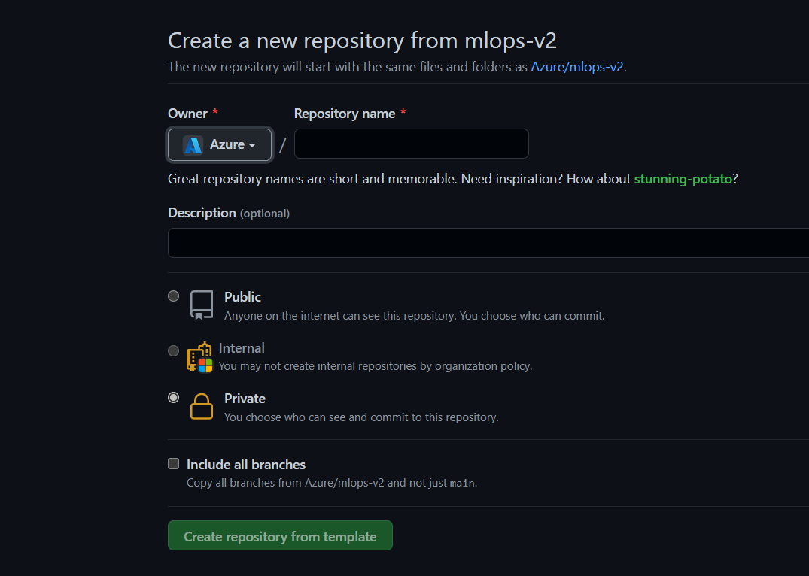
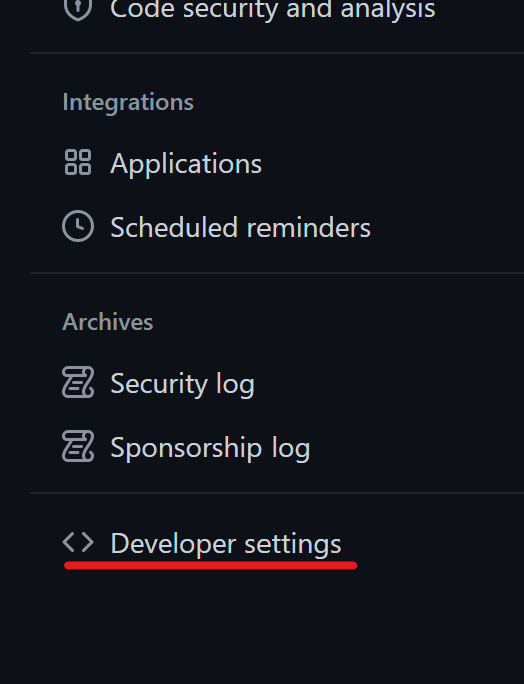
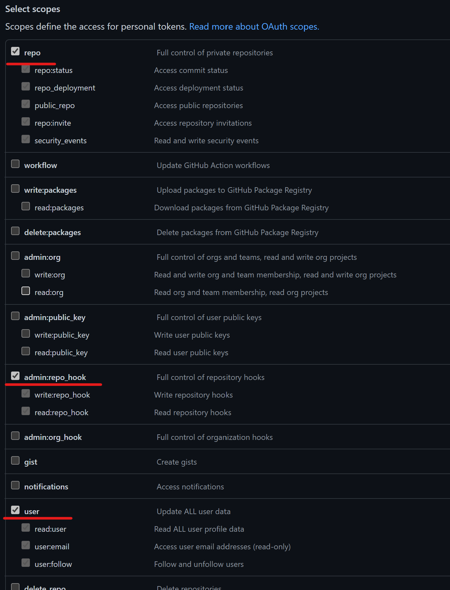
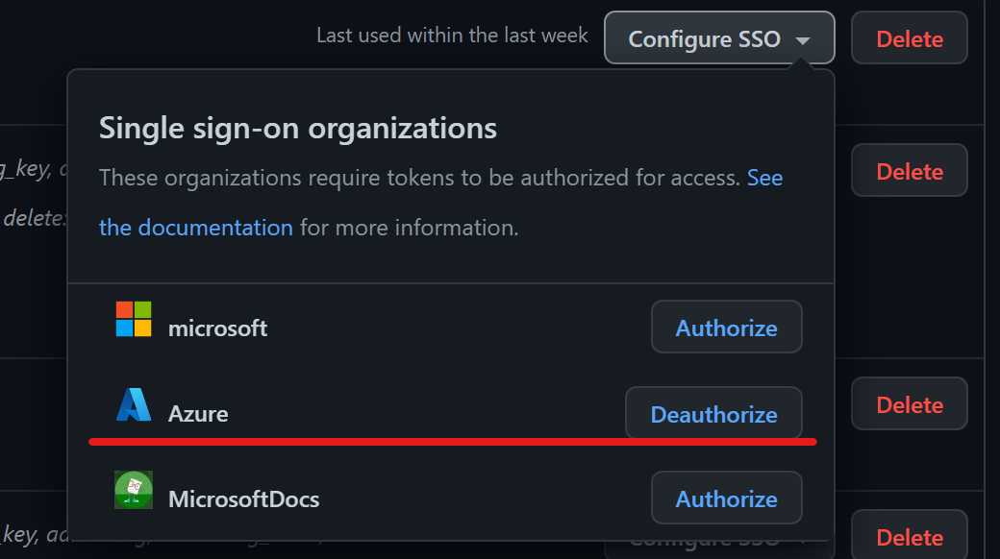
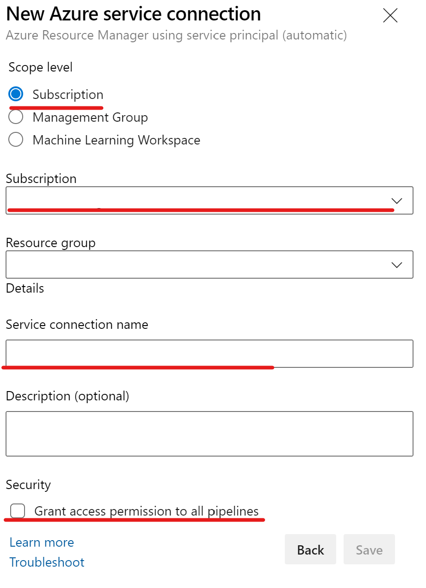
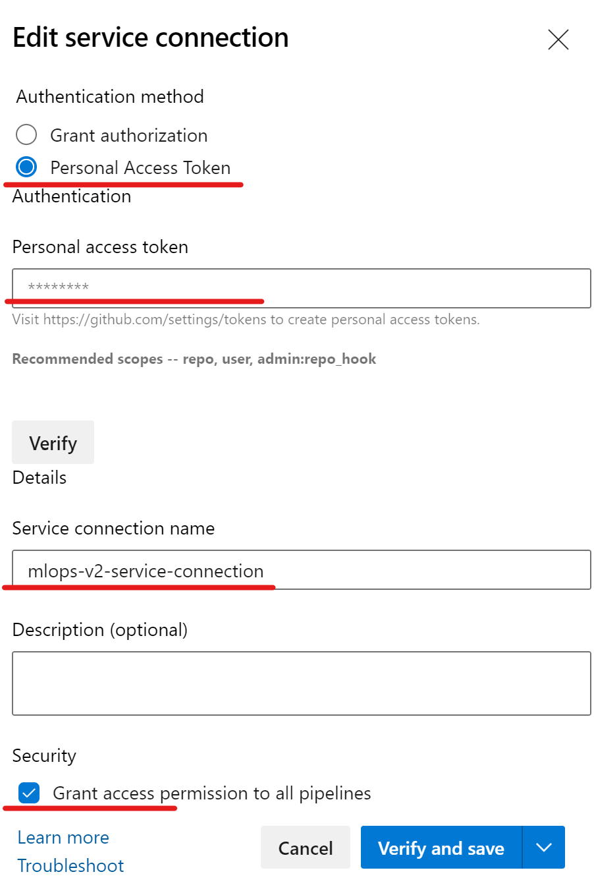
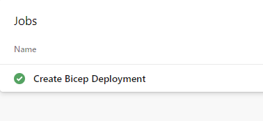
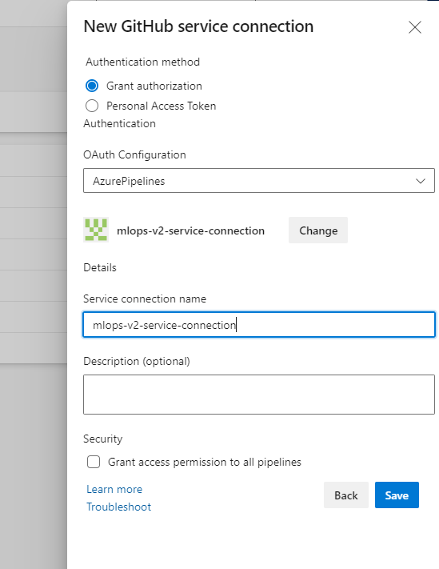

# Quickstart

## Prerequisites

**Note: This demo is based on the beta version for the MLOps Azure Machine Learning Classical ML Pattern. Due to ongoing, cli v2 changes and Azure Machine Learning enhencements, the demo can fail. The team is working on keeping the example as up-to-date as possible.**

1. Create Service Principles

   For the use of the demo, the creation of two service principles is required. Go into your Azure portal to set those up.

   Select Azure Active Directory (AAC)

   

   Select App Registrations on the left panel, then select "new registration".

   

   Go through the process of creating a Service Principle (SP) selecting "Accounts in any organizational directory (Any Azure AD directory - Multitenant)" and name it  "Azure-ARM-Dev". Once created, repeate and create a new SP named "Azure-ARM-Prod".

   Go to "Certificates & Secrets" and add for each SP "New client secret", then store the value and secret sepperately.

   Select your subscription and go to IAM. Select +Add then select "Add Role Assigment.

   

   Select Contributor and add members selecting + Select Members. Add the member "Azure-ARM-Dev" as create before.

   

   Repeat step with "Azure-ARM-Prod". The SP setup is successfully finished.

2. Set up Github Environment

   Goto https://github.com/Azure/mlops-v2.
   
   Click the button "Use this template" (if you don't see it, you might have to sign in to Github first). 
   
   
   
   After clicking the button you'll choose your github account/org and enter a repository name, optionally a description and finally click on "Create Repository from template'". 
   
   
   
   Now you should have your own Github repository with the solution accelerator.
   
   Next, create an SSO token in github by selecting "Developer settings" in your github account settings.

   
   
   Select "Personal Access Token", then generate new token. Select the check boxes and name your token "MLOpsToken". Select "Generate Token". Copy/Paste token key to a notepate interim.
   
   
   
   Now "Authorize" the token to have access to the Azure organization. If you are not a member of the Azure organization please enable it beforehand in your organisation setting.
   
   
   
   The github setup is successfully finished.

3. Set up Azure DevOps

   Go to [Azure DevOps](https://dev.azure.com/) to set up your MLOps deployment environment. To deploy the infrastructure via ADO (Azure DevOps), you will have to have an organization and a project, with a service connection to your subscription configured.
   
   Create a new organization and project in Azure Devops. Feel free to name both according to your project practices.
   
   
   
   In the project under 'Project Settings (at the bottom of the screen when in the project)' select "Service Connections".
   
   
   
   **Azure Subscription Connection:**
   
      Select "New Service Connection".

      

      Select "Azure Resource Manager", select "Next", select "Service principal (automatic)", select "Next", select your subscrption where your SP is stored and name the service connection "Azure-ARM-Prod". Select "Grant access permission to all pipelines", then select "Save". 

      
      
   **Github Connection:**
   
      Select "New Service Connection".

      
      
      Select "Github", select "Next", select "Personal Access Token" and paste your Github SSO Token in the Personal Access token field, name the "Service connection name" accordingly "mlops-v2-service-connection", grand pipeline security access, then select "Save".
      
      
      
      If it does not exist already, repeat exactly this step only name name the "Service connection name" accordingly YOUR GITHUB NAME. Finishing this step, your conection should look like this.
   
      

   The Azure DevOps setup is successfully finished.
   
   

## 1. Deploying Infrastructure via ADO (Azure DevOps)
---

## Setting Variables
---

>Right now there's just a deployment from 'main' and therefore only production artifacts are deployed.

For a quickstart, the only variables needed to be set are in 'config-infra-prod.yml'(in the root of the repo):
* If your location (Azure Region) is different from 'westus' then you'll have to adjust it to the desired one p.ex. 'westus2', 'northerneurope'.
* the function of 'namespace' is to make all your artifacts, that you're going to deploy, unique. Since there's going to be a Storage Account deployed, it has to adhere to the naming limitations of these (3-24 characters, all lowercase letters or numbers)
* as of now, the 'ado_service_connection_rg:Azure-ARM-dev' needs to have contributor permission subscription wide, since there's a resource groups being created, which contains the artifacts for the Machine Learning Workspace (Storage Account, Key Vault, Application Insights, Container Registry). You then have to create a service connection in your ADO project, which has the same name ' or adjust it here accordingly.

### Creating the infrastructure pipeline
---
Go to ADO pipelines

Then under pipelines you'll create a "New Pipeline"

and choose "GitHub" for 'Where is your Code ?'. 

You might have to create a connection to your GitHub repos via the displayed links. Then choose your Github repo and under 'Configure Your Pipeline' choose 'Existing Azure Pipelines YAML file'. 

In the dialog on the right, make sure 'main' is selected and then open the listbox and choose 'infrastructure/bicep/pipelines/bicep-iac-std-pipelines.yml'

as the path and 'Continue' button. After that you're presented with the pipeline, which you can just run (button 'Run' on the upper right)
   
   You can then run the pipeline, which should create the following artifacts:
   * Resource Group for your Workspace including Storage Account, Container Registry, Application Insights, Keyvault and the Azure Machine Learning Workspace itself.
   * In the workspace there's also a compute cluster created.

The successfully run pipeline should look like this:

## 2. Deploying Training Pipeline via ADO (Azure DevOps)
---

For the training pipeine to install, it's the same steps as above except in the part where you choose the pipeline (the dialog), which is to be found under     /mlops/devops-pipelines/aml-cli-v2/deploy-model-training-pipeline-v2.yml.

>This pipeline needs an additional connection to the Github repo Azure/mlops-templates, where all the templates are stored and maintained, which, like legos, encapsulate certain functionality. That's why you see in the pipeline itself a lot of calls to '-template: template in mlops-templates'. These functionalities are install the azure cli, or ml extension or run a pipeline etc.

Therefore you need to create a connection, which has to be named 'mlops-v2-service-connection' (sadly this has to be hardcoded like this). This connection can be created under Project Settings > Service Connections > Service Connection to Github choosing OAuth. ( and follow the prompts)

With the following endresult:

