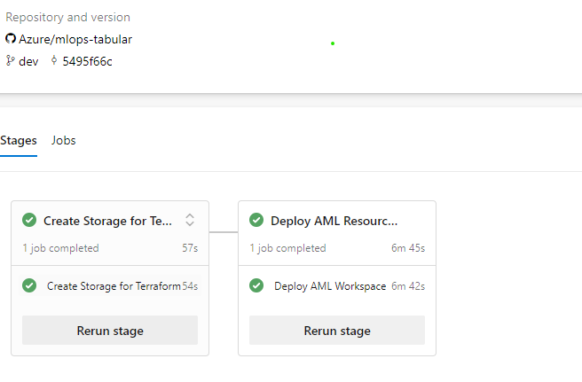

# Quickstart

## Setting Variables
---

>Right now there's just a deployment from 'main' and therefore only production artifacts are deployed.

For a quickstart, the only variables needed to be set are in 'config-infra-prod.yml'(in the root of the repo):
* If your location (Azure Region) is different from 'westus' then you'll have to adjust it to the desired one p.ex. 'westus2', 'northerneurope'.
* the function of 'namespace' is to make all your artifacts, that you're going to deploy, unique. Since there's going to be a Storage Account deployed, it has to adhere to the naming limitations of these (3-24 characters, all lowercase letters or numbers)
* as of now, the 'ado_service_connection_rg:Azure-ARM-dev' needs to have contributor permission subscription wide, since there's a resource groups being created, which contains the artifacts for the Machine Learning Workspace (Storage Account, Key Vault, Application Insights, Container Registry). You then have to create a service connection in your ADO project, which has the same name ' or adjust it here accordingly.

## Deploying Infrastructure via ADO (Azure DevOps)
---

### Clone the repo
---
Goto https://github.com/Azure/mlops-v2.

Click the button 'Use this template' (if you don't see it, you might have to sign in to Github first). 

After clicking the button you'll choose your github account/org and enter a repository name, optionally a description and finally click on 'Create Repository from template'. 

Now you should have your own Github repository with the accelerator and you'll first create the infrastructure pipeline in Azure DevOps.

### Prepare Azure DevOps (ADO) organization, project, service connection
---
To daploy the infrastructure via ADO (Azure DevOps), you will have to have an organization and a project, with a service connection to your subscription configured. An organization, you can create here (https://dev.azure.com) for free. Once you have your organization, you create a project. In the project under 'Project Settings (at the bottom of the screen when in the project)' > Service Connections, you'll create the service connection to your subscription, with subscription access. Make sure, to name it 'Azure-ARM-dev'.

### Creating the infrastructure pipeline
---
Then under pipelines you'll create a "New Pipeline" and choose "GitHub" for 'Where is your Code ?'. You might have to create a connection to your GitHub repos via the displayed links. Then choose your Github repo and under 'Configure Your Pipeline' choose 'Existing Azure Pipelines YAML file'. In the dialog on the right, make sure 'main' is selected and then open the listbox and choose 'infrastructure/bicep/pipelines/bicep-iac-std-pipelines.yml' as the path and 'Continue' button. After that you're presented with the pipeline, which you can just run (button 'Run' on the upper right)
   
   You can then run the pipeline, which should create the following artifacts:
   * Resource Group for your Workspace including Storage Account, Container Registry, Application Insights, Keyvault and the Azure Machine Learning Workspace itself.
   * In the workspace there's also a compute cluster created

The successfully run pipeline should look like this:

## Deploying Training Pipeline via ADO (Azure DevOps)
---

